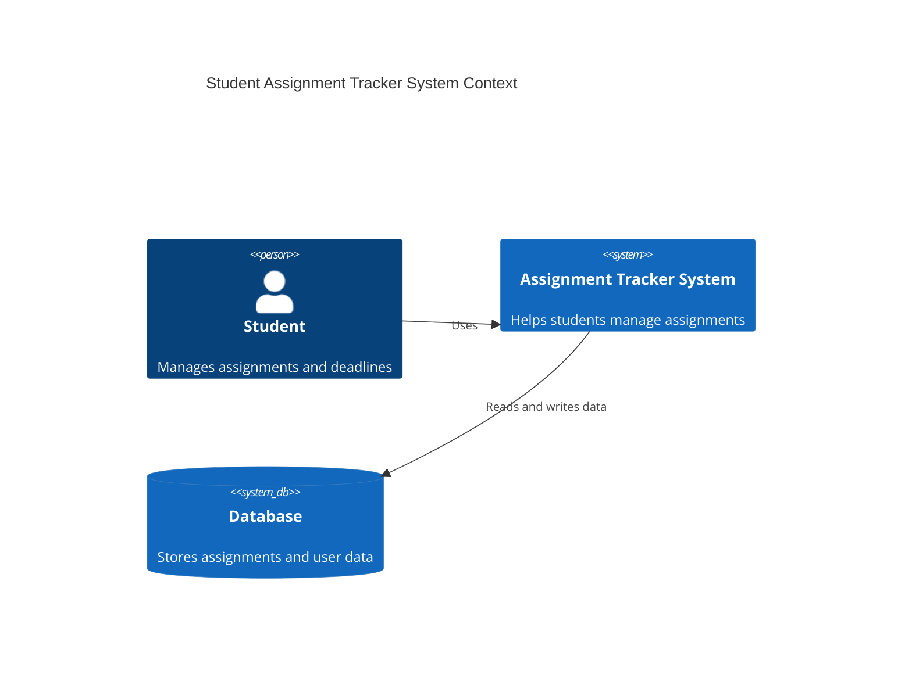
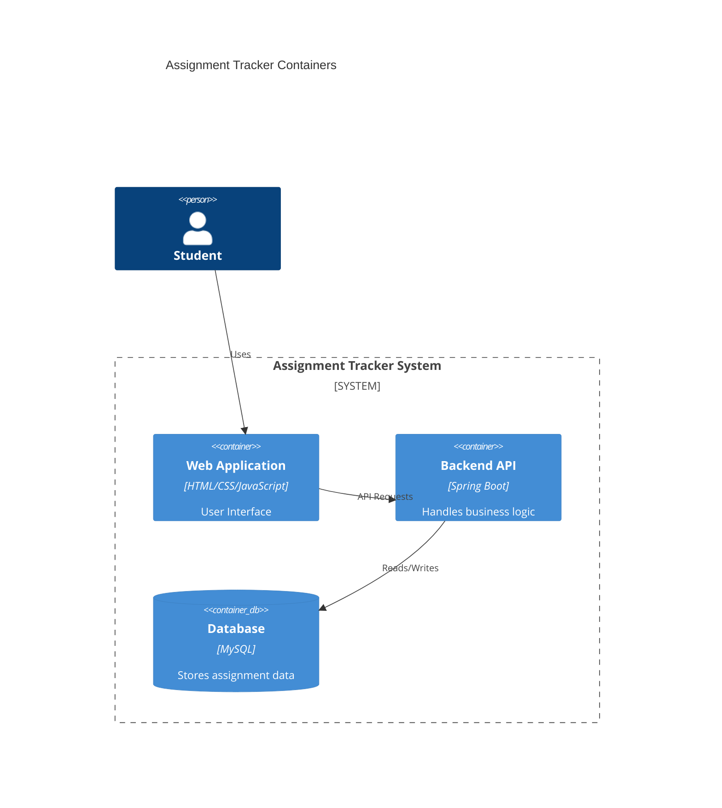
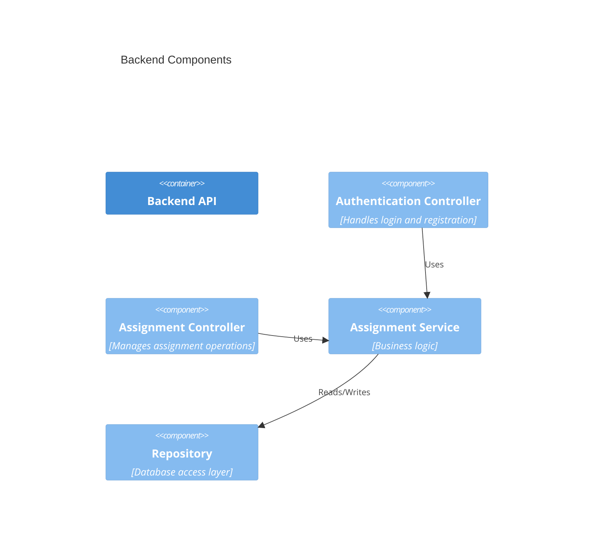

# Student Assignment Tracker System Architecture

## Domain
Education Management Systems

## Problem Statement
Students need an efficient way to manage assignments and academic deadlines in one centralized platform.

## Individual Scope
The system is designed to be developed by a single developer within four months and focuses on the core functionality required for assignment tracking and deadline management.

---

# C4 Architectural Model

## System Context Diagram

The System Context Diagram shows the interaction between the student and the assignment tracker system.

---

## Container Diagram
The System Context Diagram shows the interaction between the student and the assignment tracker system.

---

## Component Diagram
The System Context Diagram shows the interaction between the student and the assignment tracker system.
