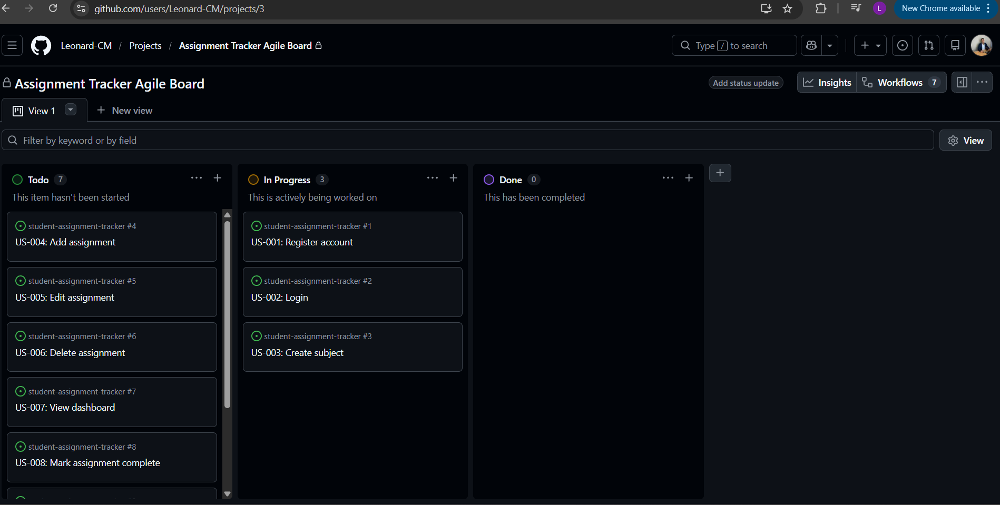
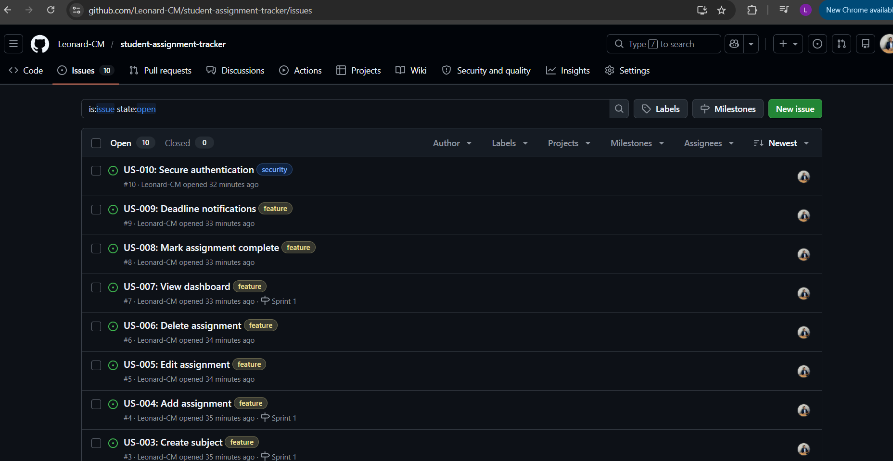
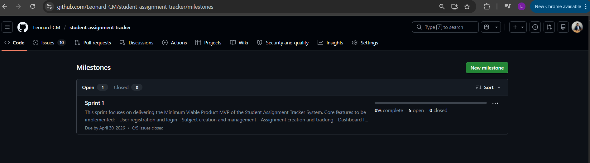
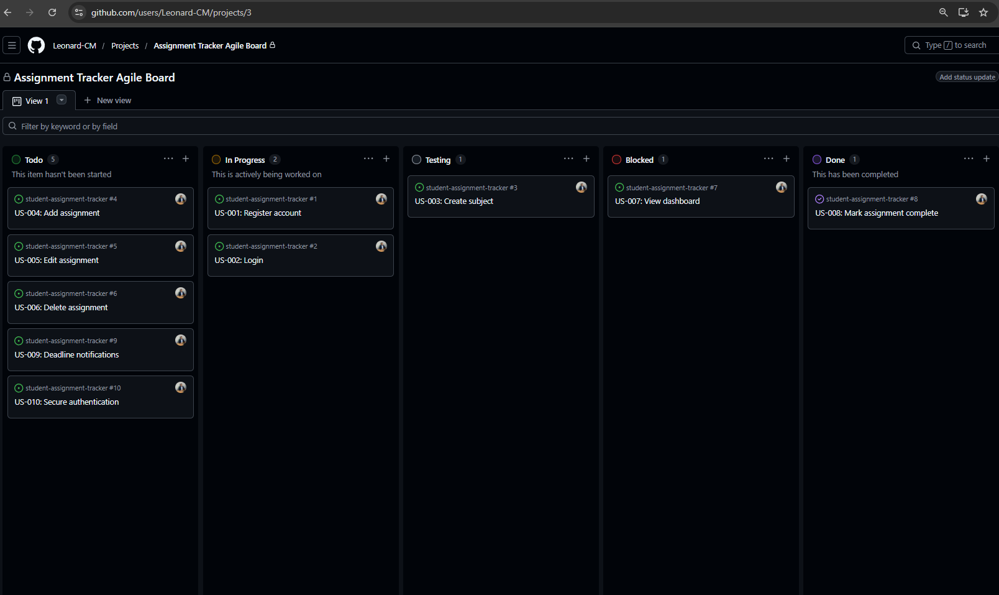
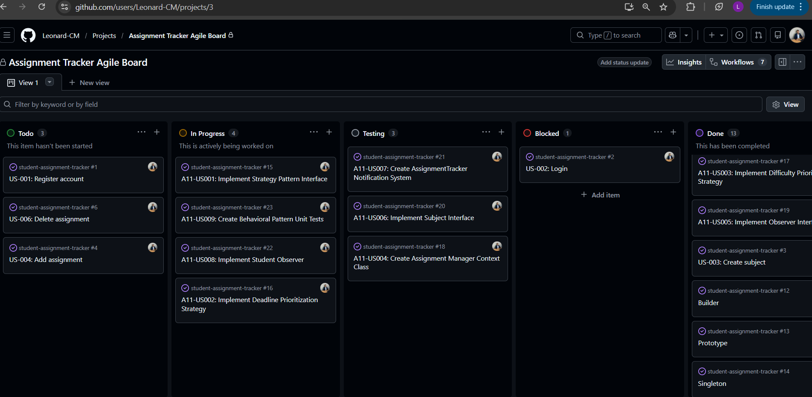
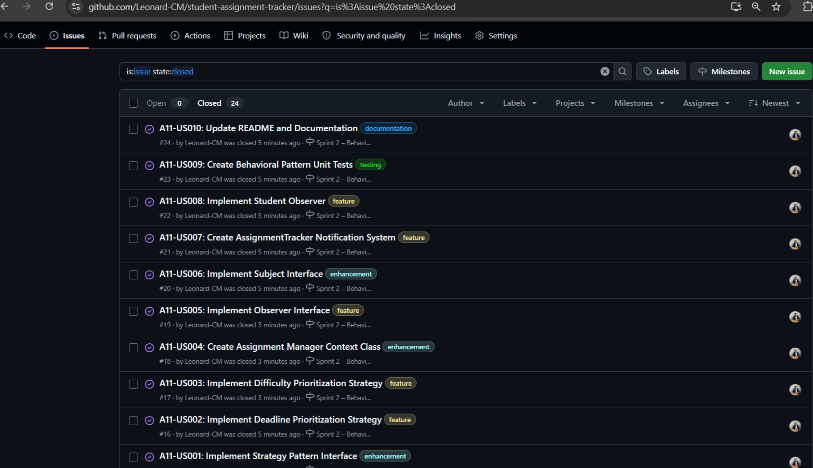
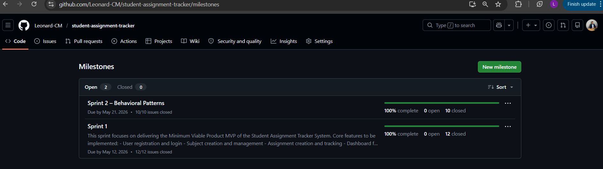

# Student app.Assignment Tracker System

## Project Description
The Student app.Assignment Tracker System is a web-based application designed to help students manage their academic assignments and deadlines efficiently.

The system allows students to organize subjects, track assignments, and monitor upcoming deadlines in one centralized platform.

## Project Documentation

System Specification:
[SPECIFICATION.md](SPECIFICATION.md)

System Architecture:
[ARCHITECTURE.md](ARCHITECTURE.md)

## Additional Documentation

Stakeholder Analysis:
[STAKEHOLDERS.md](STAKEHOLDERS.md)

System Requirements:
[REQUIREMENTS.md](REQUIREMENTS.md)

Reflection:
[REFLECTION.md](REFLECTION.md)

## Assignment 5 Documentation

Use Cases:
[USECASES.md](USECASES.md)

Test Cases:
[TESTCASES.md](TESTCASES.md)

Reflection:
[REFLECTION_A5.md](REFLECTION_A5.md)

## Assignment 6 Documentation

Agile Planning:
[AGILE.md](AGILE.md)

Reflection:
[REFLECTION_A6.md](REFLECTION_A6.md)

---

## GitHub Agile Evidence

### Project Board (Kanban)

### Issues (app.User Stories)

### Milestone (Sprint 1)

---

## Technologies Used
- Java (Spring Boot)
- MySQL
- GitHub (Issues, Projects, Milestones)
- Mermaid (Diagrams)

---

## Conclusion
This project demonstrates a complete software engineering lifecycle, including requirements gathering, system design, testing, and Agile planning.

## Assignment 7 - Kanban Board Implementation

### Template Analysis
[template_analysis.md](template_analysis.md)

### Kanban Explanation
[kanban_explanation.md](kanban_explanation.md)

### Reflection
[reflection_A7.md](reflection_A7.md)

---

### Custom Kanban Board

### Workflow Demonstration
The Kanban board demonstrates Agile workflow by moving tasks through stages:
- To Do → In Progress → Testing → Done
- Blocked tasks highlight issues preventing progress

### Customization Explanation
The board was customized by adding:

- **Testing**: Ensures tasks are verified before completion
- **Blocked**: Highlights tasks that cannot proceed

This improves workflow visibility and aligns with Agile best practices.

## Assignment 8 - System Modeling

- [State Diagrams](state_diagrams.md)
- [Activity Diagrams](activity_diagrams.md)
- [Reflection](reflection_A8.md)

## Assignment 9 - Domain Modeling

- [Domain Model](domain_model.md)
- [Class Diagram](class_diagram.md)
- [Reflection](reflection_A9.md)

## Assignment 10 - Creational Design Patterns Implementation

- [Change Log](CHANGELOG.md)
- [Reflection](REFLECTION_A10.md)

## Assignment 11 - Behavioral Design Patterns

### Overview

Assignment 11 focused on implementing Behavioral Design Patterns in the Student Assignment Tracker System.

The following patterns were implemented:
- Strategy Pattern
- Observer Pattern

These patterns improve flexibility, communication, and maintainability within the system.

---

## Strategy Pattern

The Strategy Pattern was implemented to support dynamic assignment prioritization.

### Core Classes
- `PrioritizationStrategy`
- `DeadlineStrategy`
- `DifficultyStrategy`
- `AssignmentManager`

### Purpose
Allows the system to switch prioritization behavior dynamically at runtime.

---

## Observer Pattern

The Observer Pattern was implemented to support assignment notifications.

### Core Classes
- `Observer`
- `Subject`
- `AssignmentTracker`
- `StudentObserver`

### Purpose
Allows students to receive assignment update notifications automatically.

---

## Unit Testing

JUnit 5 was used to test:
- Strategy behavior switching
- Observer notification functionality

### Test File
- `BehavioralPatternTests.java`

---

## Assignment 11 Documentation

### Reflection
[REFLECTION_A11.md](REFLECTION_A11.md)

### CHANGELOG
[CHANGELOG.md](CHANGELOG.md)

---

## GitHub Agile Evidence

### Assignment 11 Project Board

### Assignment 11 Issues

### Assignment 11 Milestone

---

## Conclusion

This assignment demonstrated the implementation of Behavioral Design Patterns using Java and JUnit 5 while applying Agile development practices through GitHub Issues, Boards, and Milestones.