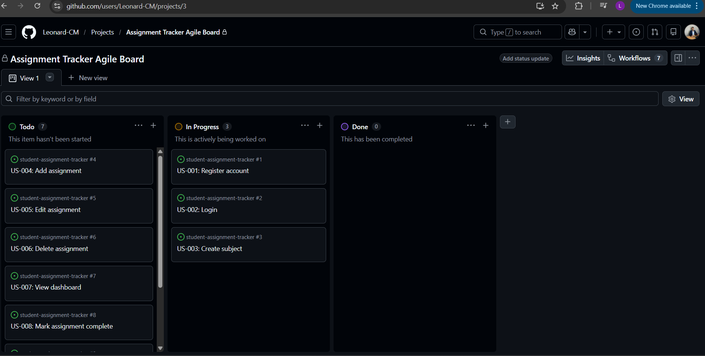
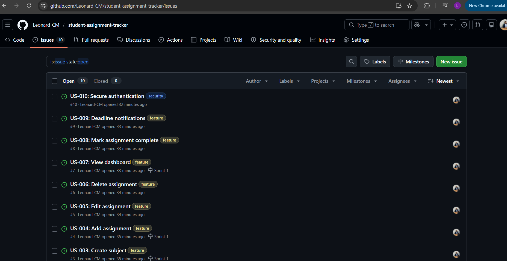
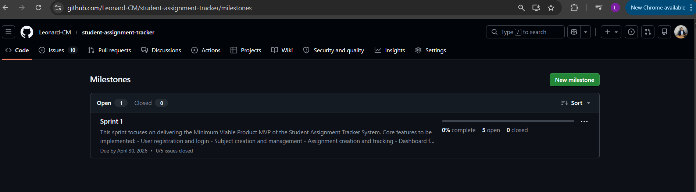
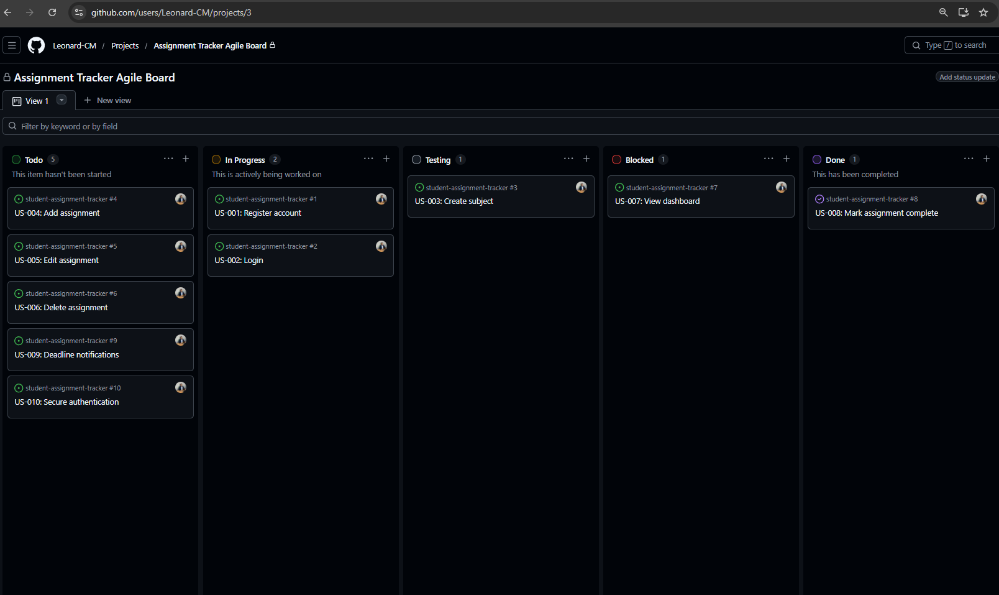
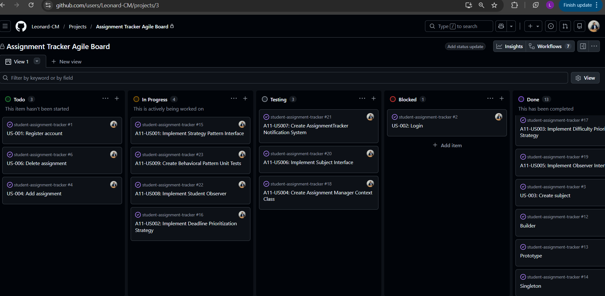
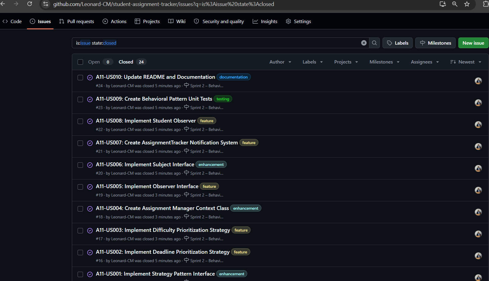
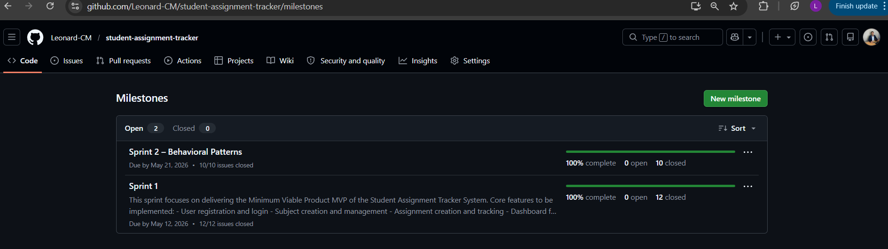
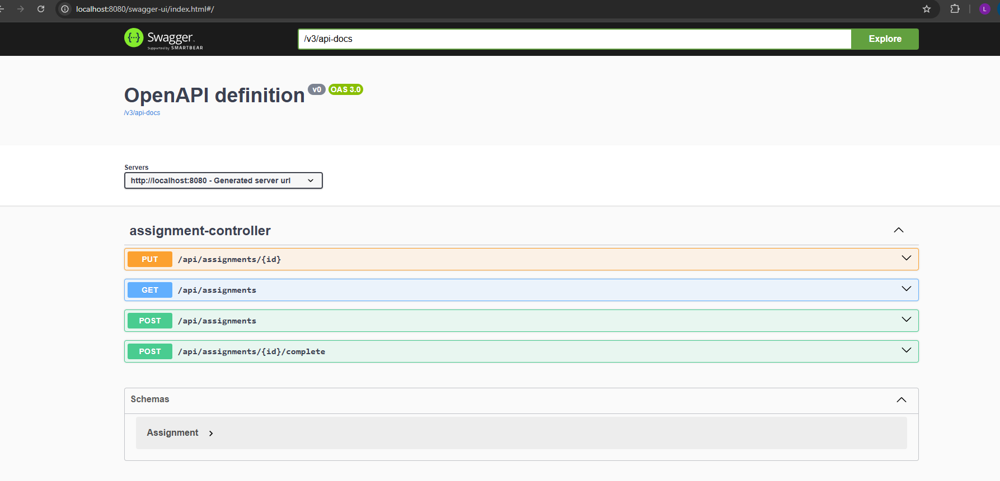
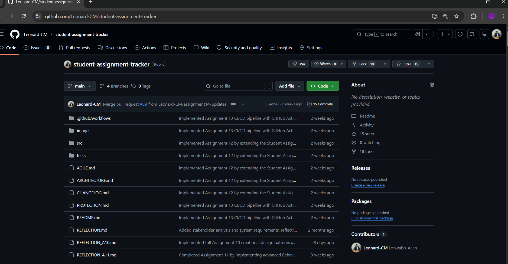

# Student Assignment Tracker System

## Project Description
The Student Assignment Tracker System is a web-based application designed to help students manage their academic assignments and deadlines efficiently.

The system allows students to organize subjects, track assignments, and monitor upcoming deadlines in one centralized platform.


## Project Documentation

System Specification:
[SPECIFICATION.md](SPECIFICATION.md)

System Architecture:
[ARCHITECTURE.md](ARCHITECTURE.md)

## Additional Documentation

Stakeholder Analysis:
[STAKEHOLDERS.md](STAKEHOLDERS.md)

System Requirements:
[REQUIREMENTS.md](REQUIREMENTS.md)

Reflection:
[REFLECTION.md](REFLECTION.md)

## Assignment 5 Documentation

Use Cases:
[USECASES.md](USECASES.md)

Test Cases:
[TESTCASES.md](TESTCASES.md)

Reflection:
[REFLECTION_A5.md](REFLECTION_A5.md)

## Assignment 6 Documentation

Agile Planning:
[AGILE.md](AGILE.md)

Reflection:
[REFLECTION_A6.md](REFLECTION_A6.md)

---

## GitHub Agile Evidence

### Project Board (Kanban)


### Issues (app.model.User Stories)


### Milestone (Sprint 1)


---

## Technologies Used
- Java (Spring Boot)
- MySQL
- GitHub (Issues, Projects, Milestones)
- Mermaid (Diagrams)

---

## Getting Started

### Prerequisites
- Java 17+
- Maven
- MySQL (if required by project)

### Setup Instructions

1. Clone the repository

```bash

git clone https://github.com/Leonard-CM/student-assignment-tracker.git
cd student-assignment-tracker

```

2. Build the project

```bash
mvn clean install

```
3. Run the application
```bash
mvn spring-boot:run

```

4. Run tests

```bash
mvn clean test
```

After running, you can access the API using Swagger UI or Postman.

## Conclusion
This project demonstrates a complete software engineering lifecycle, including requirements gathering, system design, testing, and Agile planning.

## Assignment 7 - Kanban Board Implementation

### Template Analysis
[template_analysis.md](template_analysis.md)

### Kanban Explanation
[kanban_explanation.md](kanban_explanation.md)

### Reflection
[reflection_A7.md](reflection_A7.md)

---

### Custom Kanban Board



### Workflow Demonstration
The Kanban board demonstrates Agile workflow by moving tasks through stages:
- To Do → In Progress → Testing → Done
- Blocked tasks highlight issues preventing progress

### Customization Explanation
The board was customized by adding:

- **Testing**: Ensures tasks are verified before completion
- **Blocked**: Highlights tasks that cannot proceed

This improves workflow visibility and aligns with Agile best practices.


## Assignment 8 - System Modeling

- [State Diagrams](state_diagrams.md)
- [Activity Diagrams](activity_diagrams.md)
- [Reflection](reflection_A8.md)

## Assignment 9 - Domain Modeling

- [Domain Model](domain_model.md)
- [Class Diagram](class_diagram.md)
- [Reflection](reflection_A9.md)

## Assignment 10 - Creational Design Patterns Implementation

- [Change Log](CHANGELOG.md)
- [Reflection](REFLECTION_A10.md)

## Assignment 11 - Behavioral Design Patterns

### Overview

Assignment 11 focused on implementing Behavioral Design Patterns in the Student Assignment Tracker System.

The following patterns were implemented:
- Strategy Pattern
- Observer Pattern

These patterns improve flexibility, communication, and maintainability within the system.

---

## Strategy Pattern

The Strategy Pattern was implemented to support dynamic assignment prioritization.

### Core Classes
- `PrioritizationStrategy`
- `DeadlineStrategy`
- `DifficultyStrategy`
- `AssignmentManager`

### Purpose
Allows the system to switch prioritization behavior dynamically at runtime.

---

## Observer Pattern

The Observer Pattern was implemented to support assignment notifications.

### Core Classes
- `Observer`
- `Subject`
- `AssignmentTracker`
- `StudentObserver`

### Purpose
Allows students to receive assignment update notifications automatically.

---

## Unit Testing

JUnit 5 was used to test:
- Strategy behavior switching
- Observer notification functionality

### Test File
- `BehavioralPatternTests.java`

---

## Assignment 11 Documentation

### Reflection
[REFLECTION_A11.md](REFLECTION_A11.md)

### CHANGELOG
[CHANGELOG.md](CHANGELOG.md)

---

## GitHub Agile Evidence

### Assignment 11 Project Board


### Assignment 11 Issues


### Assignment 11 Milestone


---

## Conclusion

This assignment demonstrated the implementation of Behavioral Design Patterns using Java and JUnit 5 while applying Agile development practices through GitHub Issues, Boards, and Milestones.

## Assignment 12 - Service Layer and REST API

### Overview

Assignment 12 focused on implementing a Service Layer and RESTful API for the Student Assignment Tracker System using Spring Boot.

### Features Implemented
- Repository layer
- Service layer business logic
- RESTful CRUD API endpoints
- Assignment completion workflow
- Swagger/OpenAPI documentation
- Unit and integration testing

### API Endpoints

| Method | Endpoint | Description |
|---|---|---|
| GET | /api/assignments | Fetch all assignments |
| POST | /api/assignments | Create assignment |
| PUT | /api/assignments/{id} | Update assignment |
| POST | /api/assignments/{id}/complete | Complete assignment |

### Swagger Documentation



### Reflection
[REFLECTION_A12.md](REFLECTION_A12.md)

## Assignment 13 - CI/CD with GitHub Actions

### Overview

Assignment 13 focused on implementing Continuous Integration and Continuous Deployment (CI/CD) using GitHub Actions.

### Features Implemented

- Automated test execution
- Maven build automation
- JAR artifact generation
- Branch protection rules
- Pull request validation
- GitHub Actions workflow automation

### CI/CD Workflow

The GitHub Actions workflow automatically:

1. Runs on every push
2. Runs on pull requests to main
3. Executes all unit and integration tests
4. Builds the Spring Boot application
5. Uploads a JAR artifact when merged to main

### Running Tests Locally

```bash
mvn clean test

---

# Assignment 14 - Open Source Collaboration

## Open Source Repository Preparation

Assignment 14 focused on transforming the Student Assignment Tracker System into a professional open-source ready GitHub repository.

The repository was prepared for collaboration through:

- Contributor onboarding documentation
- GitHub Issues and labels
- Roadmap planning
- Open-source licensing
- Community engagement
- Professional repository management

---

## Contributor Documentation

### Contribution Guidelines
[CONTRIBUTING.md](CONTRIBUTING.md)

### Project Roadmap
[ROADMAP.md](ROADMAP.md)

### Community Engagement
[VOTING_RESULTS.md](VOTING_RESULTS.md)

### Reflection
[REFLECTION_A14.md](REFLECTION_A14.md)

---

## Open Source Features

The repository includes:

- MIT License
- Protected branches
- Pull request validation
- GitHub Actions CI/CD
- Automated testing
- Contributor onboarding
- Good first issues
- Feature request tracking

---

## Contribution Workflow

Contributors follow this workflow:

1. Fork the repository
2. Create a feature branch
3. Implement changes
4. Run tests
5. Submit pull request
6. Pass CI/CD validation
7. Merge after review

---

## Collaboration Readiness

The project was prepared for open-source collaboration through:

- Clear setup instructions
- Coding standards
- Testing procedures
- GitHub issue tracking
- CI/CD automation
- Agile GitHub workflows

---

## Future Development Goals

Planned future enhancements include:

- JWT authentication
- Mobile application support
- Analytics dashboard
- Cloud deployment
- Real-time notifications
- Improved UI/UX
- Performance optimization

---

## License

This project is licensed under the MIT License.

---

## Community Engagement Evidence

The repository was shared with peers to encourage open-source participation and collaboration.

### Repository Community Metrics



The project received community interaction through:
- Repository stars
- Repository forks
- Peer feedback
- Contribution discussions