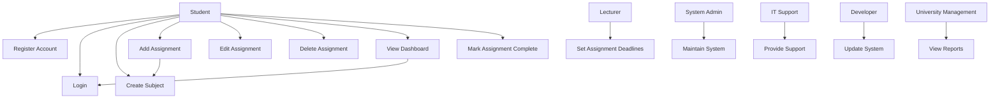

# Use Case Diagram

The following diagram illustrates how different stakeholders interact with the system's core functionalities.

## Use Case Explanation

### Key Actors
- **Student**: Primary user interacting with the system.
- **Lecturer**: Defines assignment deadlines.
- **System Administrator**: Maintains system functionality.
- **IT Support**: Handles technical issues.
- **Developer**: Updates and improves the system.
- **University Management**: Monitors performance and reports.

### Relationships
- The **Student** performs most system operations.
- The **Add Assignment** use case includes **Create Subject**, ensuring assignments belong to a subject.
- The **View Dashboard** use case includes **Login**, enforcing authentication.

### Stakeholder Alignment
This diagram addresses key concerns such as:
- Students needing better organization
- Lecturers wanting fewer late submissions
- IT staff requiring system stability

# Use Case Specifications

## UC1: Register Account
Actor: Student  
Precondition: User is not registered  
Postcondition: User account is created

Basic Flow:
1. User enters email and password
2. System validates input
3. Account is created

Alternative Flow:
- Invalid email → Show error

---

## UC2: Login
Actor: Student  
Precondition: User has an account  
Postcondition: User is authenticated

Basic Flow:
1. Enter credentials
2. System validates
3. Access granted

Alternative Flow:
- Invalid credentials → Error message

---

## UC3: Create Subject
Actor: Student  
Precondition: User logged in  
Postcondition: Subject saved

Basic Flow:
1. Enter subject name
2. Save subject

---

## UC4: Add Assignment
Actor: Student  
Precondition: Subject exists  
Postcondition: Assignment created

Basic Flow:
1. Enter assignment details
2. Save

---

## UC5: Edit Assignment
Actor: Student  
Precondition: Assignment exists  
Postcondition: Assignment updated

Basic Flow:
1. Select assignment
2. Update details

---

## UC6: Delete Assignment
Actor: Student  
Precondition: Assignment exists  
Postcondition: Assignment removed

Basic Flow:
1. Select assignment
2. Delete

---

## UC7: View Dashboard
Actor: Student  
Precondition: Logged in  
Postcondition: Assignments displayed

Basic Flow:
1. Open dashboard
2. View assignments

---

## UC8: Mark Assignment Complete
Actor: Student  
Precondition: Assignment exists  
Postcondition: Assignment marked complete

Basic Flow:
1. Select assignment
2. Mark complete  