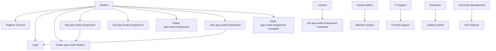

# Use Case Diagram

The following diagram illustrates how different stakeholders interact with the system's core functionalities.

## Use Case Explanation

### Key Actors
- **Student**: Primary user interacting with the system.
- **Lecturer**: Defines assignment deadlines.
- **System Administrator**: Maintains system functionality.
- **IT Support**: Handles technical issues.
- **Developer**: Updates and improves the system.
- **University Management**: Monitors performance and reports.

### Relationships
- The **Student** performs most system operations.
- The **Add app.model.Assignment** use case includes **Create app.model.Subject**, ensuring assignments belong to a subject.
- The **View app.model.Dashboard** use case includes **Login**, enforcing authentication.

### Stakeholder Alignment
This diagram addresses key concerns such as:
- Students needing better organization
- Lecturers wanting fewer late submissions
- IT staff requiring system stability

# Use Case Specifications

## UC1: Register Account
Actor: Student  
Precondition: app.model.User is not registered  
Postcondition: app.model.User account is created

Basic Flow:
1. app.model.User enters email and password
2. System validates input
3. Account is created

Alternative Flow:
- Invalid email → Show error

---

## UC2: Login
Actor: Student  
Precondition: app.model.User has an account  
Postcondition: app.model.User is authenticated

Basic Flow:
1. Enter credentials
2. System validates
3. Access granted

Alternative Flow:
- Invalid credentials → Error message

---

## UC3: Create app.model.Subject
Actor: Student  
Precondition: app.model.User logged in  
Postcondition: app.model.Subject saved

Basic Flow:
1. Enter subject name
2. Save subject

---

## UC4: Add app.model.Assignment
Actor: Student  
Precondition: app.model.Subject exists  
Postcondition: app.model.Assignment created

Basic Flow:
1. Enter assignment details
2. Save

---

## UC5: Edit app.model.Assignment
Actor: Student  
Precondition: app.model.Assignment exists  
Postcondition: app.model.Assignment updated

Basic Flow:
1. Select assignment
2. Update details

---

## UC6: Delete app.model.Assignment
Actor: Student  
Precondition: app.model.Assignment exists  
Postcondition: app.model.Assignment removed

Basic Flow:
1. Select assignment
2. Delete

---

## UC7: View app.model.Dashboard
Actor: Student  
Precondition: Logged in  
Postcondition: Assignments displayed

Basic Flow:
1. Open dashboard
2. View assignments

---

## UC8: Mark app.model.Assignment Complete
Actor: Student  
Precondition: app.model.Assignment exists  
Postcondition: app.model.Assignment marked complete

Basic Flow:
1. Select assignment
2. Mark complete  