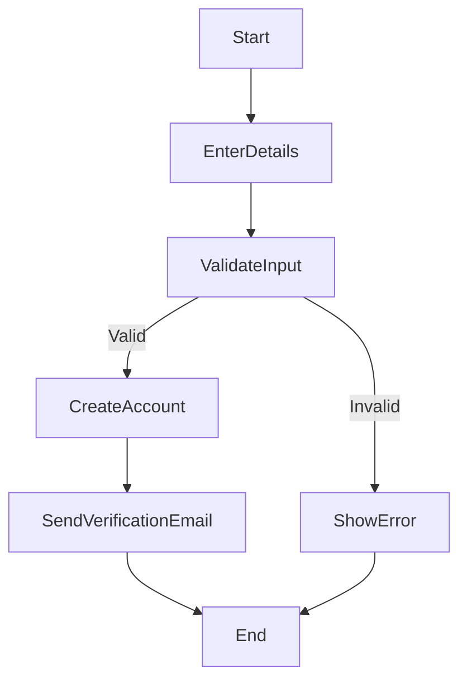
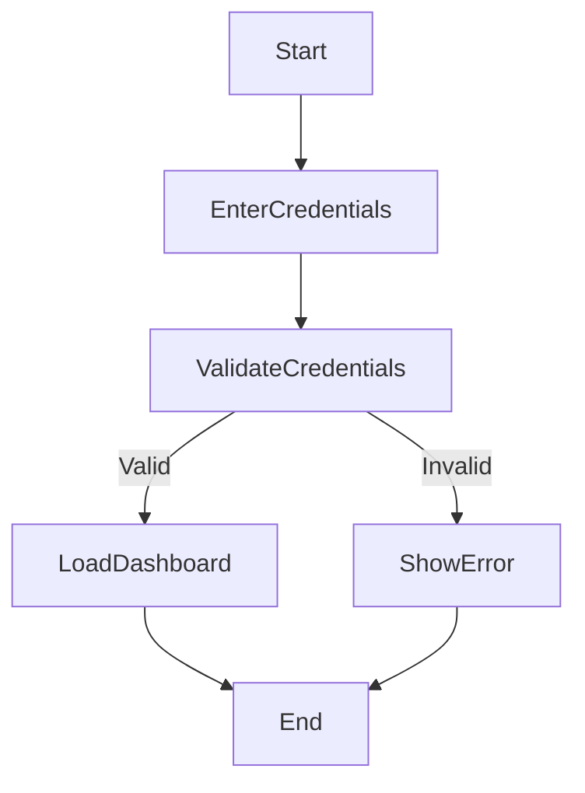
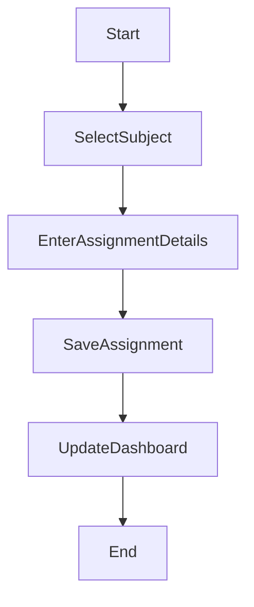
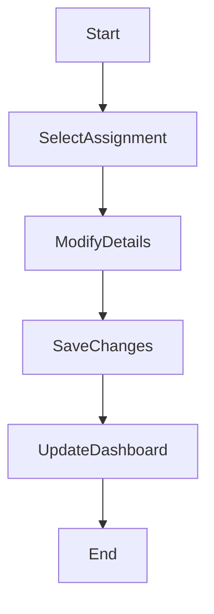
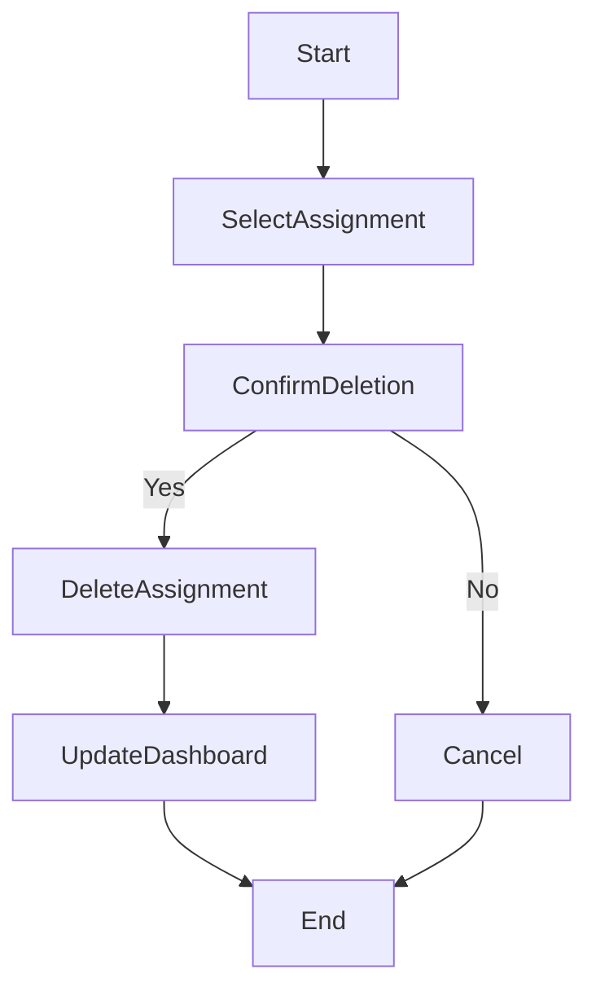
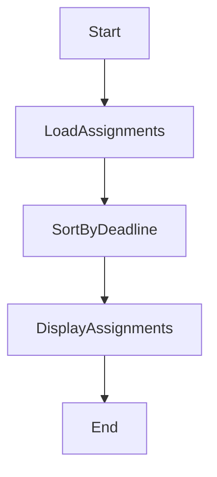
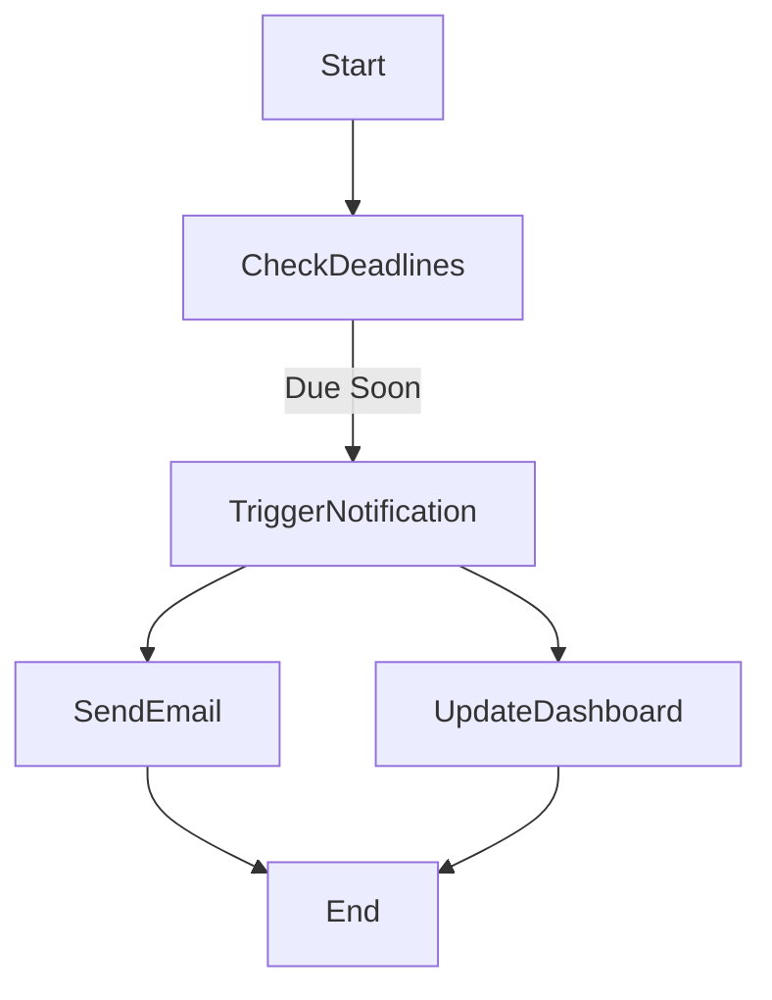
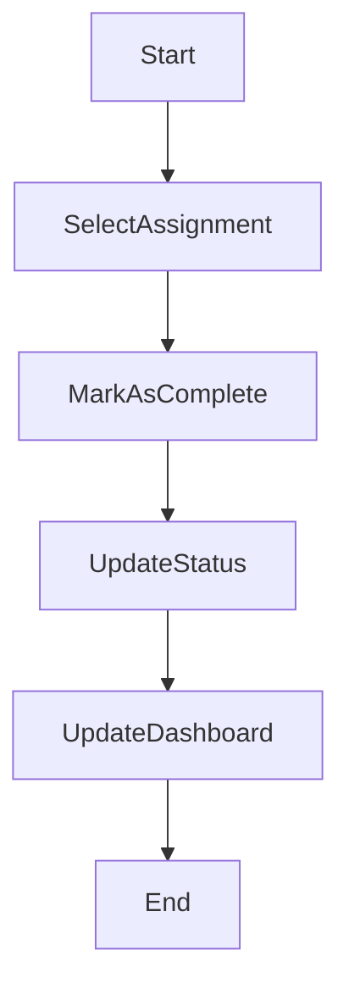

# app.model.Assignment 8 - Activity Diagrams

This document models system workflows using UML activity diagrams.

---

## 1. app.model.User Registration Workflow

### Explanation
- This workflow begins when the user enters registration details
- A decision point validates the input
- If valid, the account is created and a verification email is sent
- If invalid, an error is shown
- Maps to:
    - FR-002: app.model.User authentication
    - US-001: Register Account

---

## 2. Login Workflow

### Explanation
- app.model.User enters login credentials
- System validates credentials
- Valid users access dashboard, invalid users see an error
- Maps to:
    - FR-002: Authentication
    - US-002: Login

---

## 3. Add app.model.Assignment Workflow

### Explanation
- app.model.User selects a subject and enters assignment details
- app.model.Assignment is saved and dashboard is updated
- Maps to:
    - FR-001: app.model.Assignment management
    - US-004: Add app.model.Assignment

---

## 4. Edit app.model.Assignment Workflow

### Explanation
- app.model.User selects an assignment and modifies details
- Changes are saved and reflected on the dashboard
- Maps to:
    - FR-001: app.model.Assignment management
    - US-005: Edit app.model.Assignment

---

## 5. Delete app.model.Assignment Workflow

### Explanation
- app.model.User selects assignment and confirms deletion
- Decision ensures deletion is intentional
- Maps to:
    - FR-001: app.model.Assignment management
    - US-006: Delete app.model.Assignment

---

## 6. app.model.Dashboard Viewing Workflow

### Explanation
- System loads and organizes assignments
- Assignments are sorted by deadline and displayed
- Maps to:
    - FR-003: app.model.Dashboard functionality
    - US-007: View app.model.Dashboard

---

## 7. app.model.Notification Workflow (Parallel Processing)

### Explanation
- System checks assignment deadlines
- If deadlines are near, notifications are triggered
- Parallel processes:
    - Sending email notification
    - Updating dashboard alerts
- Maps to:
    - FR-004: Deadline tracking
    - US-009: Notifications

---

## 8. Mark app.model.Assignment Complete Workflow

### Explanation
- app.model.User selects an assignment and marks it complete
- System updates status and reflects changes on dashboard
- Maps to:
    - FR-004: Progress tracking
    - US-008: Mark app.model.Assignment Complete

---

## Traceability

These activity diagrams align with:

### Functional Requirements (app.model.Assignment 4)
- FR-001: app.model.Assignment management
- FR-002: app.model.User authentication
- FR-003: app.model.Dashboard functionality
- FR-004: Deadline tracking

### app.model.User Stories (app.model.Assignment 6)
- US-001: Register Account
- US-002: Login
- US-004: Add app.model.Assignment
- US-005: Edit app.model.Assignment
- US-006: Delete app.model.Assignment
- US-007: View app.model.Dashboard
- US-008: Mark app.model.Assignment Complete
- US-009: Notifications