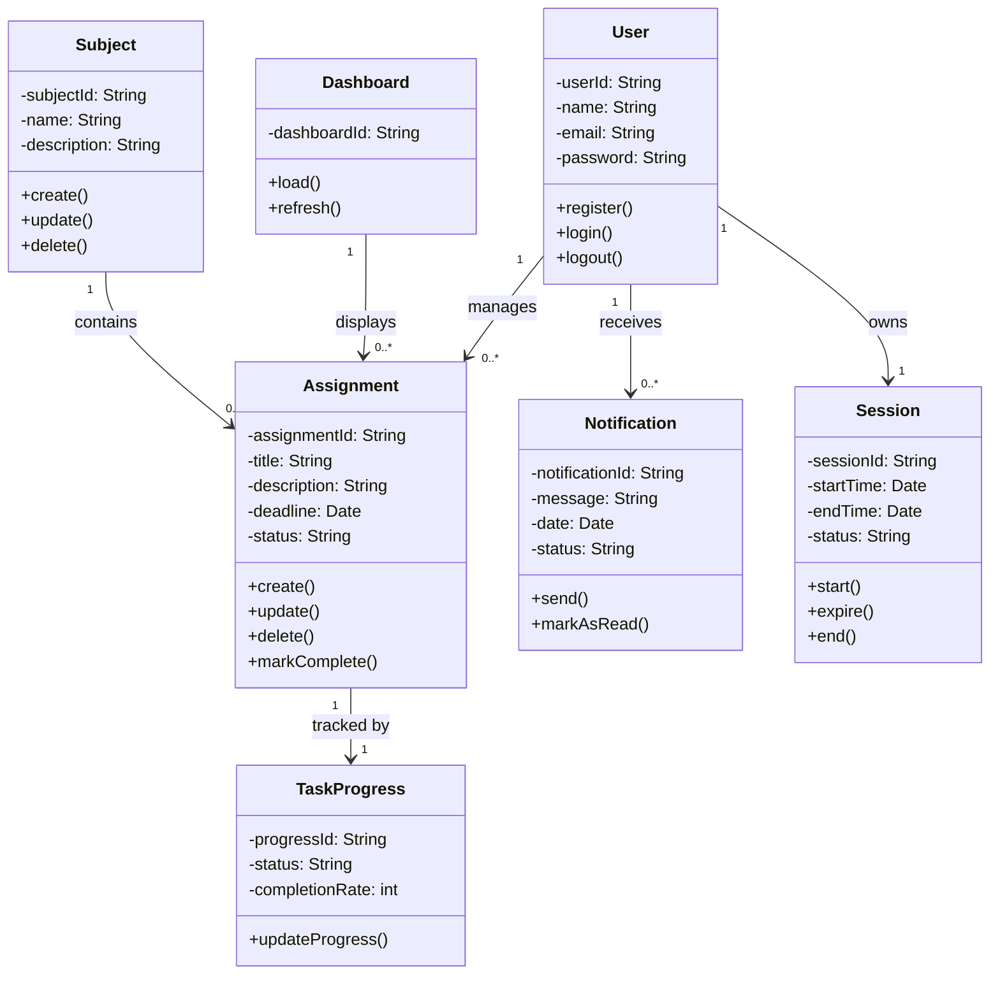

# Assignment 9 - Class Diagram

This class diagram represents the system structure using UML and Mermaid.js.

---

## Explanation of Design Decisions

- The **User** class is central and manages assignments, sessions, and notifications.
- The **Assignment** class contains core business logic for tracking tasks.
- The **Subject** class organizes assignments into categories.
- The **Notification** class supports reminders for deadlines.
- The **Session** class ensures secure login management.
- The **TaskProgress** class tracks completion state separately for flexibility.
- The **Dashboard** aggregates assignment data for display.

### Relationship Types

- Association: User → Assignment
- Aggregation: Subject → Assignment
- Composition: Assignment → TaskProgress
- One-to-many relationships reflect real-world usage

This structure ensures scalability, maintainability, and alignment with object-oriented design principles.