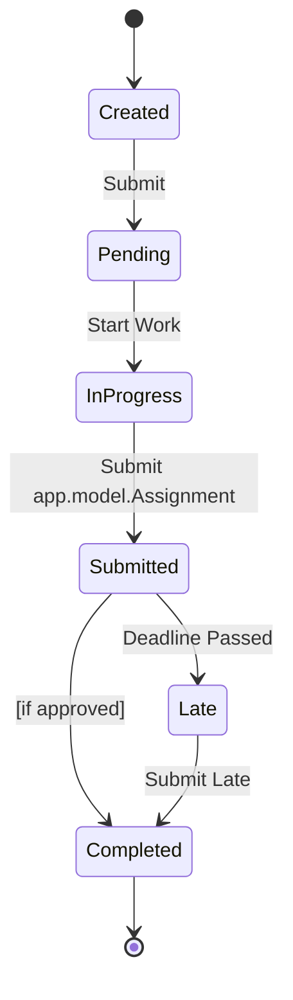
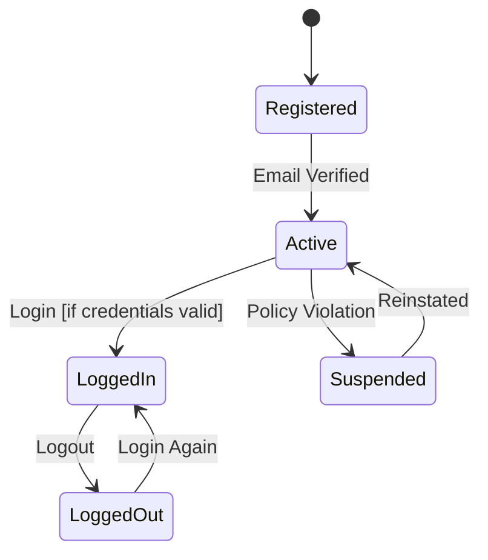
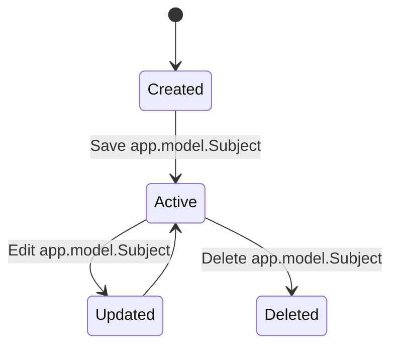
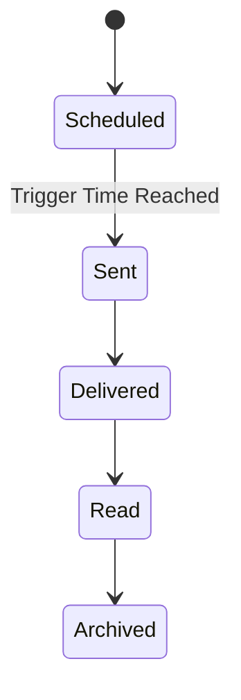
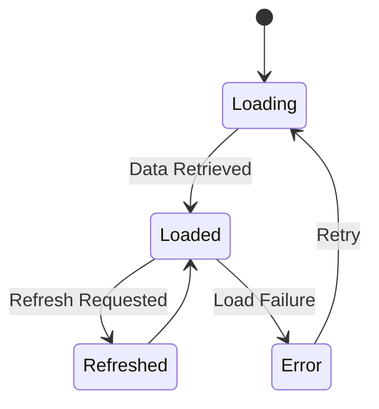
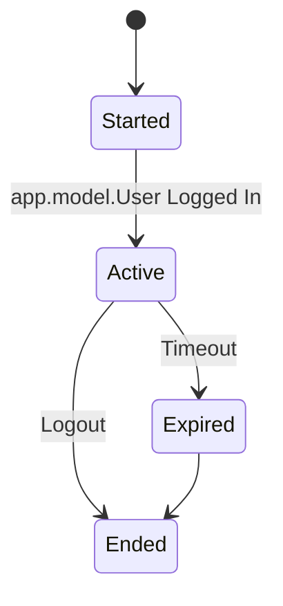
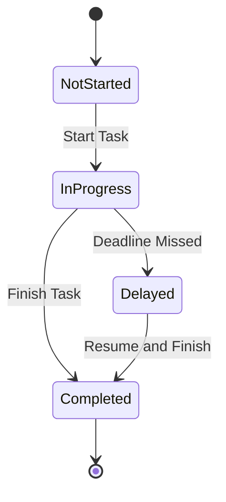

# app.model.Assignment 8 - State Transition Diagrams

This document models the lifecycle of key system objects using UML state transition diagrams.

---

## 1. app.model.Assignment Object

### Explanation
- Key states: Created, Pending, InProgress, Submitted, Completed, Late
- Guard condition: app.model.Assignment only transitions to Completed if approved
- Transition:
    - "Submitted → Late" occurs when the deadline passes before submission
- This diagram models the full lifecycle of an assignment from creation to completion
- Maps to:
    - FR-001: app.model.Assignment management
    - FR-004: Deadline tracking
    - US-004: Add app.model.Assignment
    - US-008: Mark app.model.Assignment Complete

---

## 2. app.model.User Account Object

### Explanation
- Key states: Registered, Active, LoggedIn, LoggedOut, Suspended
- Guard condition: Login only succeeds if credentials are valid
- Transition:
    - "Active → Suspended" occurs when user violates system policies
- This diagram represents the authentication and account lifecycle
- Maps to:
    - FR-002: app.model.User authentication
    - US-001: Register Account
    - US-002: Login

---

## 3. app.model.Subject Object

### Explanation
- Key states: Created, Active, Updated, Deleted
- Transition:
    - "Active → Updated" occurs when a subject is modified
- This diagram models how subjects are created, updated, and removed
- Maps to:
    - FR-001: app.model.Assignment organization
    - US-003: Create app.model.Subject

---

## 4. app.model.Notification Object

### Explanation
- Key states: Scheduled, Sent, Delivered, Read, Archived
- Transition:
    - "Scheduled → Sent" is triggered when the notification time is reached
- This diagram represents the lifecycle of reminders and alerts
- Maps to:
    - FR-004: Deadline tracking
    - US-009: Notifications

---

## 5. app.model.Dashboard Object

### Explanation
- Key states: Loading, Loaded, Refreshed, Error
- Transition:
    - "Loaded → Error" occurs when data fails to load
- This diagram models system behavior when displaying assignment data
- Maps to:
    - FR-003: app.model.Dashboard functionality
    - US-007: View app.model.Dashboard

---

## 6. app.model.Session Object

### Explanation
- Key states: Started, Active, Expired, Ended
- Guard condition: app.model.Session expires after inactivity timeout
- Transition:
    - "Active → Expired" occurs when the session times out
- This diagram ensures secure session management
- Maps to:
    - FR-002: Security and authentication
    - US-002: Login

---

## 7. Task Progress Object

### Explanation
- Key states: NotStarted, InProgress, Completed, Delayed
- Transition:
    - "InProgress → Delayed" occurs when a deadline is missed
- This diagram tracks assignment progress over time
- Maps to:
    - FR-004: Progress tracking
    - US-008: Mark app.model.Assignment Complete

---

## Traceability

These diagrams align with:

### Functional Requirements (app.model.Assignment 4)
- FR-001: app.model.Assignment management
- FR-002: app.model.User authentication
- FR-003: app.model.Dashboard functionality
- FR-004: Deadline tracking

### app.model.User Stories (app.model.Assignment 6)
- US-001: Register Account
- US-002: Login
- US-003: Create app.model.Subject
- US-004: Add app.model.Assignment
- US-007: View app.model.Dashboard
- US-008: Mark app.model.Assignment Complete
- US-009: Notifications